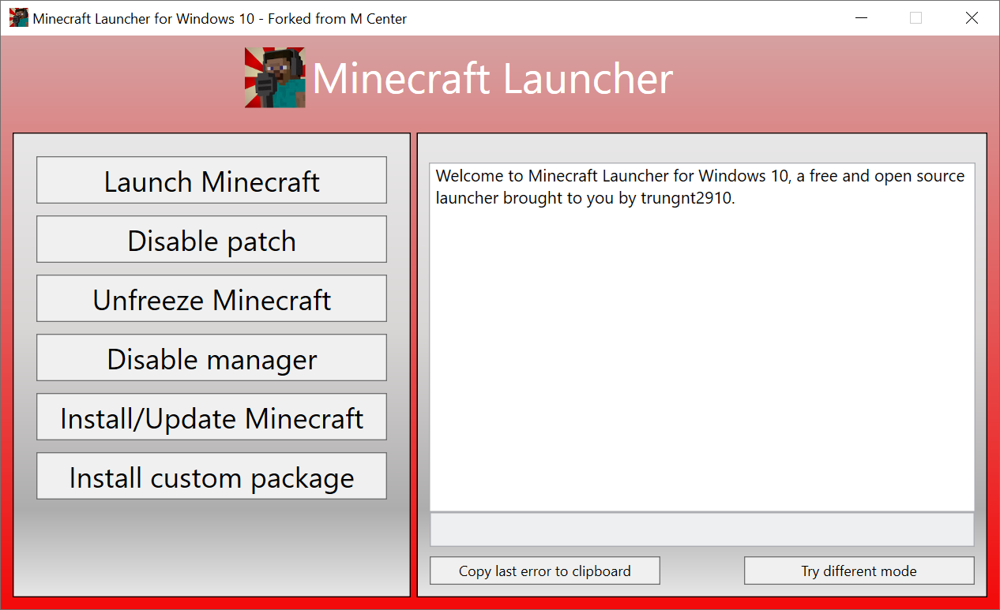

# A custom launcher for Minecraft Bedrock



## How to use  

- Build the solution  
- Run `MinecraftBedrockLauncher.exe` as an Administrator.
- Click on Install and Update Minecraft to get the latest version of Minecraft, from the server of Microsoft. Alternatively, you can install Minecraft from the Microsoft Store or from patched `appx` files online (not recommended, they may contain viruses!).
- Click on `Launch Minecraft`, the game should start!
- Enjoy!

## Bugs and Feature requests
Any requests should go [here](https://github.com/trungnt2910/MinecraftLauncher/issues).

## Contribution
This project, like many other C# projects, uses the popular coding style of [the .NET foundation](https://github.com/dotnet/runtime/blob/main/docs/coding-guidelines/coding-style.md). Being forked from another source, this project may contain confusing and disorganized code, which will be refactored when I have time. However, any new code must follow these guidelines.

## License
This project free sofware, covered by the terms of the [Root License](https://github.com/trungnt2910/RootLicense/blob/master/LICENSE.md).
